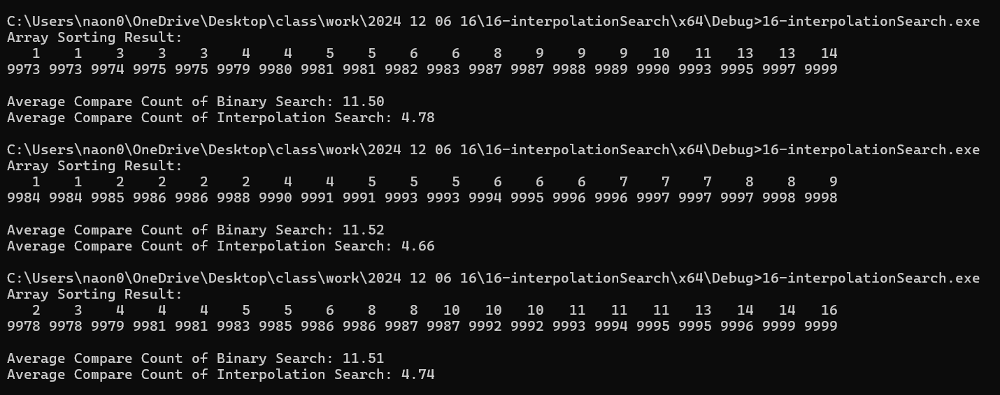

# interpolationSearch { Result Image }

Interpolation Search가 Binary Search보다 적게 비교하는 이유

Binary Search는 배열의 중간값을 선택하는 반면, Interpolation Search는 배열의 현재 구간의 값 범위와 target의 값을 기반으로 target이 있을 법한 위치를 계산
Interpolation Search는 매번 계산된 위치를 기준으로 target을 찾기 때문

배열이 정렬되어 있고 값이 균등하게 분포되어 있는 경우, Interpolation Search는 Binary Search보다 적은 비교 횟수를 필요
그러나, 배열이 고르지 않거나 값들이 분포가 불균등한 경우, Interpolation Search는 효율적이지 않거나 최악의 경우 매우 많은 비교가 발생 가능

 
